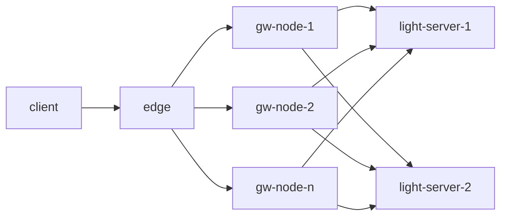
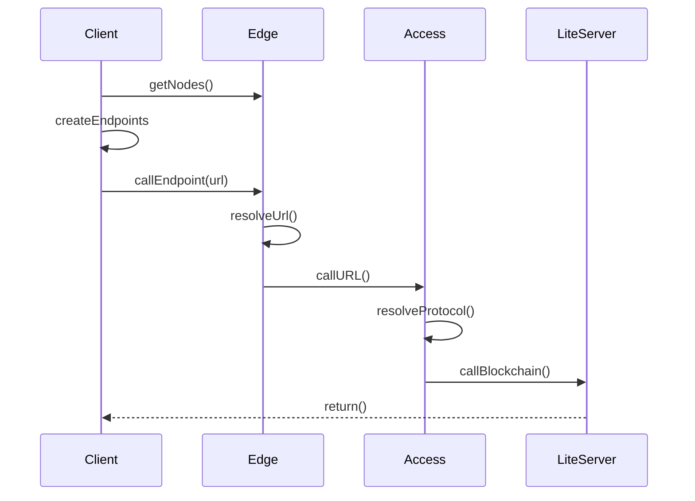


# ton-access spec
A client side decentralised access to the [ton blockchain](https://ton.org/)
This document shows how it should be build

## Introduction (Chachak)
- Web3 Access, Metamask, Infura
- Decentralized access to a blockchain
- Centralised bottleneck compromise
- Why is it still decentralised
## overview

### Flow dequence diagram


### edge endpoint
- client endpoint url example 
`https://ton.access.orbs.network/19e116699fd6c7ad754a912af633aafec27cc456/1/mainnet/toncenter-api-v2/getMasterchainInfo`
- format `https://{edge-host}/{gw-id}/{url-version}/{network}/{protocol}/{suffix}`
	- `edge-host` default: `ton.access.orbs.network` 
	- `node-id`: id recogniser of the access-node
	- `url-version` increase if we change edge/gw logic
	- `network` - the blockchain network
		- `mainnet`
		- `testnet`
	- `protocol` (or flavor)
		- `toncenter-api-v2` 			
		- `ton-api-v4`
		- `adnl-proxy`
	- `suffix` - explicit endpoint per each protocol e.g `getMasterchainInfo`
	
## client
- create and endpoint to be parsed by the edge
- uses edge/nodes api
- bot/server that interacts with ton blockchain using the gw
- dApp - browser client
- implemented in typescript [npm package](https://www.npmjs.com/package/@orbs-network/ton-access)
client code exaple
```ts
import { getTonCenterV2Endpoint } from  '../src/index'

const  endpoint = await  getTonCenterV2Endpoint();
const  client = new  TonClient({ endpoint });

// make a query to mainnet
const  address = Address.parseFriendly("EQCD39VS5jcptHL8vMjEXrzGaRcCVYto7HUn4bpAOg8xqB2N").address;
const  balance = await  client.getBalance(address);
```
## edge
* SSL Termination
* HTTP + WS
* Healthcheck - against the access nodes, /nodes api should report unhealthy
* API
	* /nodes 
	* /route
* reverese proxy to correct backend inferred from URL/Endpoint 
* Rate limit per IP
* CORS

### API
#### /nodes
returns JSON with data about the access NODEs
`https://ton.access.orbs.network/nodes`
```json
[
	{
		"Name": "19e116699fd6c7ad754a912af633aafec27cc456",
		"Ip": "18.221.31.187",
		"Healthy": "1"
	},
	{
		"Name": "1cde611619e2a466c87a23b64870397436082895",
		"Ip": "3.140.253.61",
		"Healthy": "1"
	}
]
```
> There should be a way for the client to authenticate the nodes are indeed a ton valid blockchain and not imposters. This kind of authentication makes the fact that the edge is centralised, a non issue.

#### /route
`https://ton.access.orbs.network/route/1/mainnet/toncenter-api-v2/getMasterchainInfo`
lets the edge randomly choses with which backend access-node to pass the call to, as opposed to explicitly call the node by ID. 
## Access node
### Protocols / Flavours 
- `protocol` (or flavor)
	- `toncenter-api-v2` 
		- [docs](https://toncenter.com/api/v2/) 
		- two dockers per each network running on the GW node.
		- possible run redis for internal cache (see in docs) 
	- `ton-api-v4`
		- [docs](https://github.com/orbs-network/ton-api-v4)
		- only one mainnet docker
		- compiled by orbs to use [this fix](https://github.com/TrueCarry/ton-lite-client) 
	- `adnl-proxy`
		- [docs](https://github.com/tonstack/wsadnlroxy)
		- websocket listener - edge should be ware of
		- compiled go process
		- needs a watchdog
## Lite Server
- [become a ton validator](https://github.com/ton-blockchain/mytonctrl/blob/master/docs/en/manual-ubuntu.md)
- extract config liteserver part to be used by protocols
```json
- "liteservers": [
    {
      "ip": 84478511,
      "port": 19949,
      "id": {
        "@type": "pub.ed25519",
        "key": "n4VDnSCUuSpjnCyUk9e3QOOd6o0ItSWYbTnW3Wnn8wk="
      }
    },
```
### Use the same machine for Validator and Protocol implementations
- Pros
	- latency
	- healthcheck (by the edge)
- Cons
	- redundancy
	- load balancing
	- inter process interference 
	- port management
